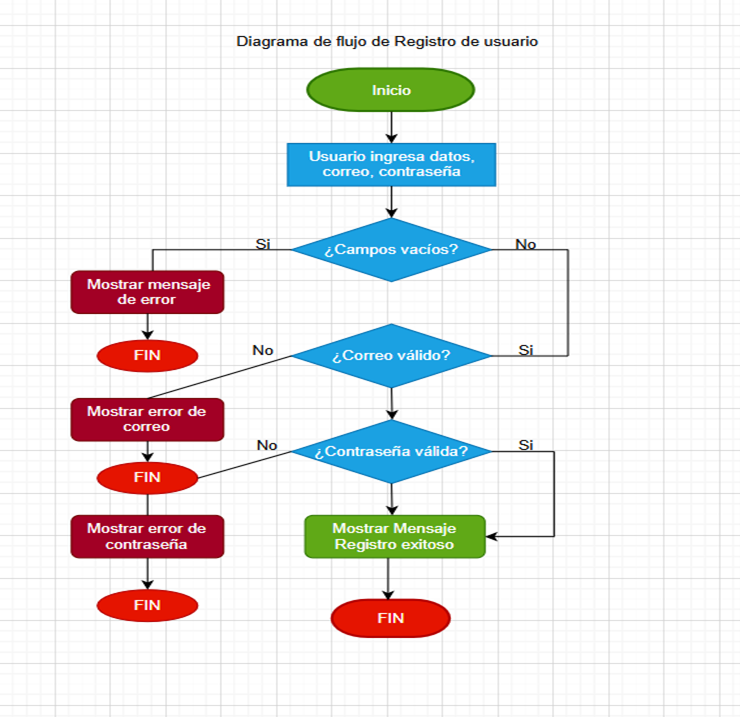

# Formulario de Registro con JavaScript

## Descripción
Proyecto básico de formulario de registro desarrollado con HTML, CSS y JavaScript.
Simula una funcionalidad real utilizada en aplicaciones web.

# Mi proyecto

## Diagrama de flujo

[Ver diagrama en grande](images/diagrama-formulario.png)

## Funcionalidades
- Validación de campos obligatorios
- Validación básica de correo electrónico
- Mensajes de error y éxito

## Tecnologías utilizadas
- HTML
- CSS
- JavaScript

## Autor
Yudisney Domínguez